<div align="center">


### **From Financial Data to Intelligent Decisions**


[](https://colab.research.google.com/drive/1qdm39UOnB7qQUSCbRjnKjOZniCnCs9MQ#scrollTo=BgxUpgUyj1BP)

*Created by **Mansi Kushwaha** × **Sheetal** · Evolved from **DigiMentor AI 3.0***

</div>

---

## ⚡ MANSHORA in 30 seconds

| 🧩 | 🤖 | 🔒 | 🌐 |
|:---:|:---:|:---:|:---:|
| **14** modules | **14** AI agents | **0** fake data | **0** backend |
| Customer + Bank | Council synthesis | Real inputs only | Runs in browser |

> **Financial data exists. Financial understanding doesn't.** MANSHORA is the intelligence layer that closes that gap for both customers and banks.

<details>
<summary><b>🙋 Who is this for? (click to see what's in it for you)</b></summary>
<br>

| If you are... | You will find... |
|---|---|
| 👤 **A customer** | A health score, a chatbot in 3 languages, simulations, scam checks and a plan for your next step |
| 🏦 **A bank manager** | Segmentation, a digital adoption heatmap, risk signals and product opportunities |
| 🧑‍⚖️ **A hackathon judge** | A working prototype tied to SBI × GFF Theme 2, with honest limitations stated up front |
| 👩‍💻 **A developer** | A zero-backend architecture, formulas, and a clear roadmap to production |

</details>

---

## 🧭 Overview

MANSHORA turns raw financial data into clear understanding and concrete next steps.

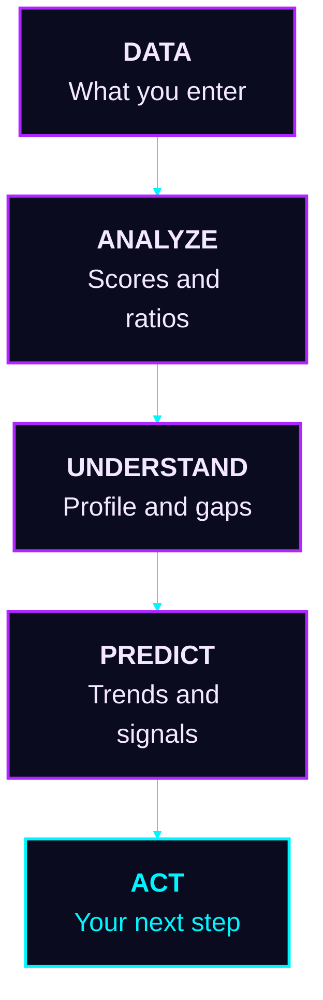

<table>
<tr>
<td width="50%" valign="top">

### 👤 For Customers
- 💯 Financial health score
- 📅 Monthly tracking
- 🧠 AI-style insights
- 🧪 Simulations and goals
- 📱 Digital adoption analysis
- 💬 Financial chatbot
- 🎉 Life-event signals

</td>
<td width="50%" valign="top">

### 🏦 For Banks / Managers
- 🧬 Customer segmentation
- 📱 Digital adoption analysis
- ⚠️ Risk signals
- 🎁 Product opportunities
- 📈 Investment / insurance opportunities
- 📣 Campaign monitoring
- 🧭 Executive intelligence

</td>
</tr>
</table>

---

## 🛤️ Our Journey

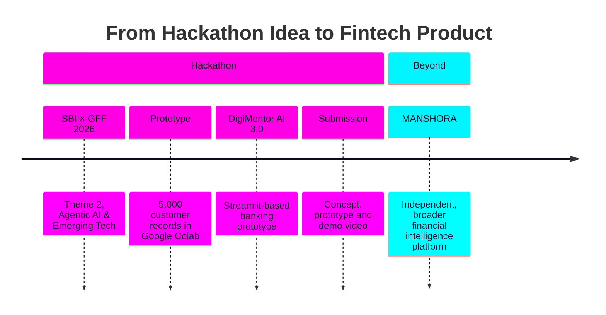

> 🌱 We chose not to stop at the idea phase. The prototype became the foundation for a broader platform.

---

## ⚠️ The Problem

<details open>
<summary><b>👤 Customers have data, not answers</b></summary>
<br>

- ❓ Am I saving enough?
- ❓ Can I afford a loan?
- ❓ How much emergency fund do I need?
- ❓ Should I invest more?
- ❓ How well am I using digital banking?
- ❓ Which goal should I prioritize?

**Result:** fragmented financial information.

</details>

<details open>
<summary><b>🏦 Banks have signals, not next actions</b></summary>
<br>

- 📉 Digital adoption gaps
- 🧩 Customer segments
- 🎁 Product opportunities
- 🤝 Engagement opportunities
- ⚠️ Financial risk signals
- 🎯 Next-best actions

**Result:** fragmented customer signals.

</details>

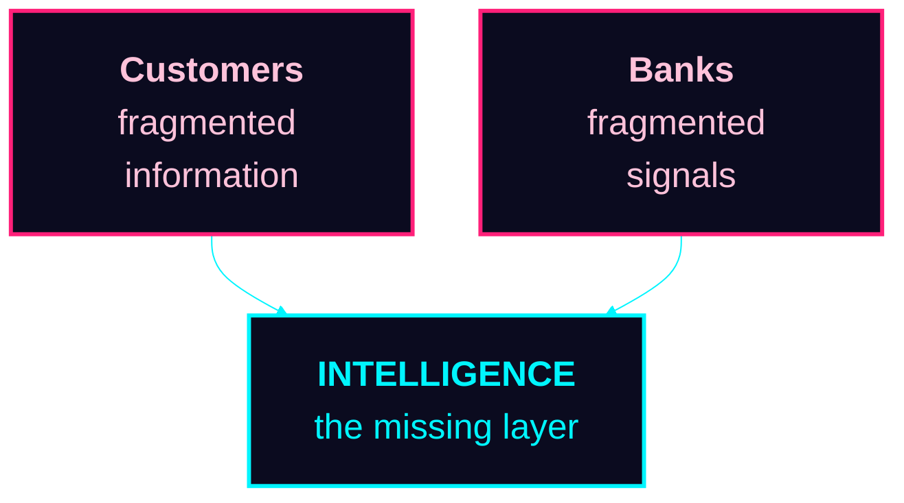

---

## 🧩 Product Ecosystem

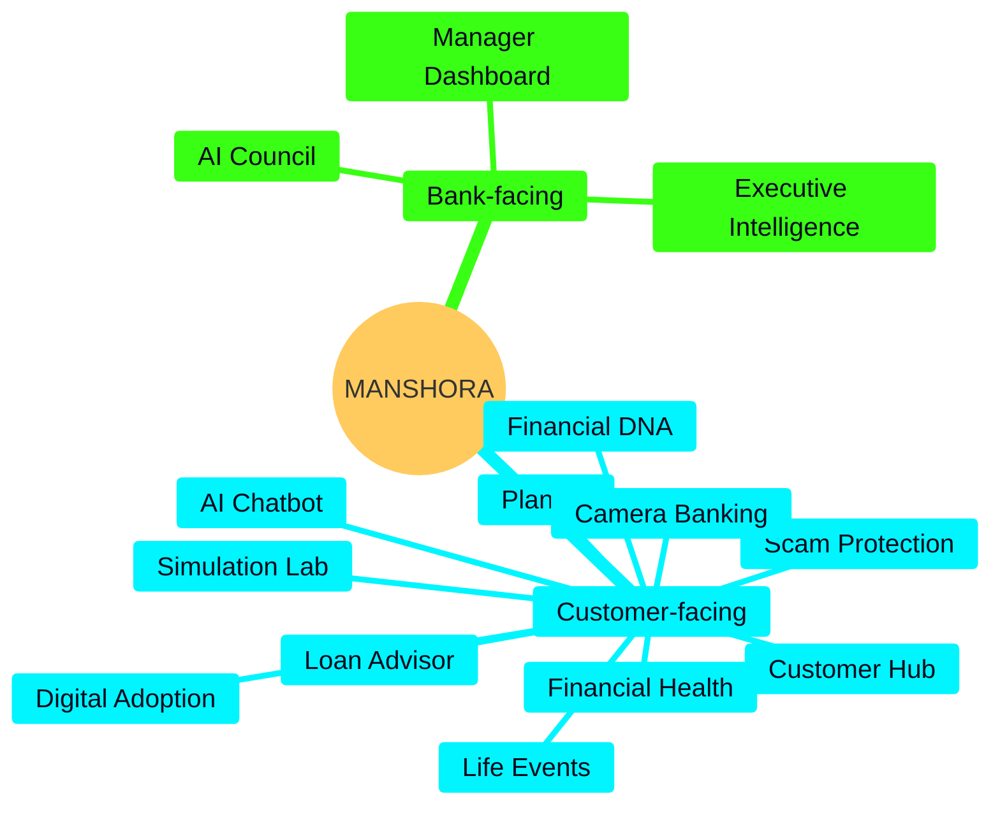

---

## 🔒 Trust by Design

> **One rule we never break: no fake data.**

| ✅ We do | ❌ We never |
|---|---|
| Calculate insights from available inputs | Invent customer numbers |
| Show missing info as **"Not Provided"** | Hard-code financial outcomes |
| Label every simulated output | Present simulations as facts |
| Frame recommendations as educational | Promise guaranteed advice |

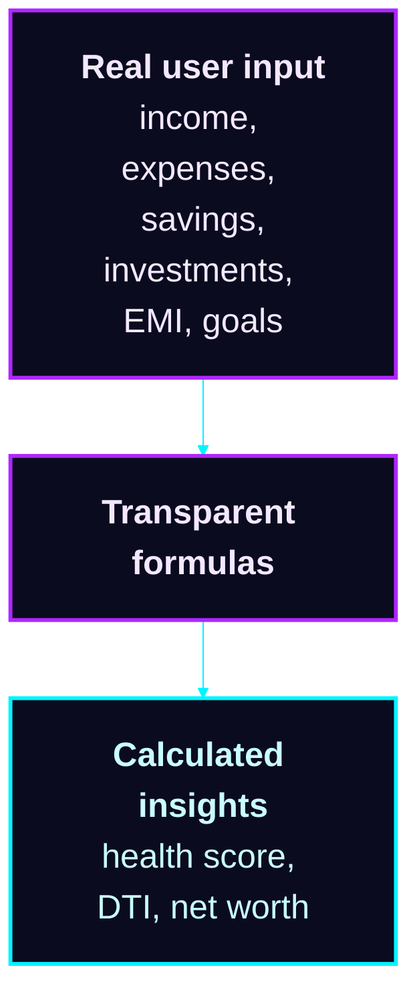

*Transparency is a feature.*

---

## 🔬 Feature Deep Dive

> 👇 **Click any feature to open it.** Each one is short, and each ends with an honest note on what it is and isn't.

<details>
<summary><b>📅 1. Monthly Financial Memory</b> · <i>your story, month by month</i></summary>
<br>

- Each month stores **income, expenses, EMI, savings and investments**
- Add only the new month; earlier months are **retained, never overwritten**
- History powers trends, KPIs, forecasts and recommendations
- Forecasts use **linear regression** on saved history

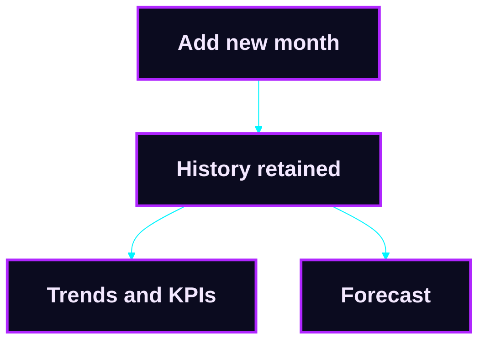

</details>

<details>
<summary><b>💯 2. Financial Health Dashboard</b> · <i>a 100-point score</i></summary>
<br>

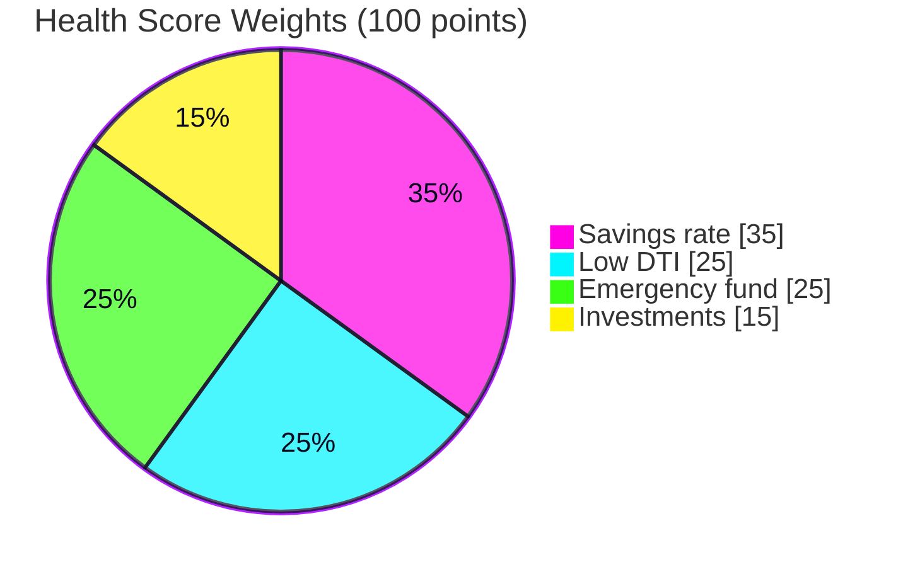

**9 KPIs:** Health Score · Income · Expenses · DTI · Savings · Savings Rate · Investments · Outstanding Loans · Net Worth (plus Digital Adoption)

</details>

<details>
<summary><b>🧬 3. Financial DNA & Digital Twin</b> · <i>a profile, not isolated metrics</i></summary>
<br>

- Six dimensions: **Saver · Investor · Borrower · Digital User · Protector · Planner**
- **Risk appetite:** Conservative / Moderate / Aggressive
- **Digital adoption gaps** across UPI, Mobile Banking and Internet Banking
- Searchable in the Customer Hub by name, ID or city

</details>

<details>
<summary><b>🤖 4. AI Council</b> · <i>14 agents, one synthesis</i></summary>
<br>

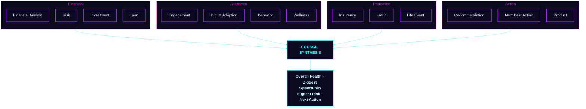

Each agent returns **Status · Recommendation · Confidence · Reason**.

> Rule-based logic and heuristics only. No hidden chain-of-thought, no claim of autonomous LLM reasoning.

</details>

<details>
<summary><b>📱 5. Digital Adoption Intelligence</b> · <i>SBI GFF Theme 2</i></summary>
<br>

- **Digital Adoption Score (0–100)** from UPI, mobile and internet banking usage
- **Gaps** from missing or low usage
- **30-Day Action Plan**, **Personalized Nudges**, **Potential Next Products**

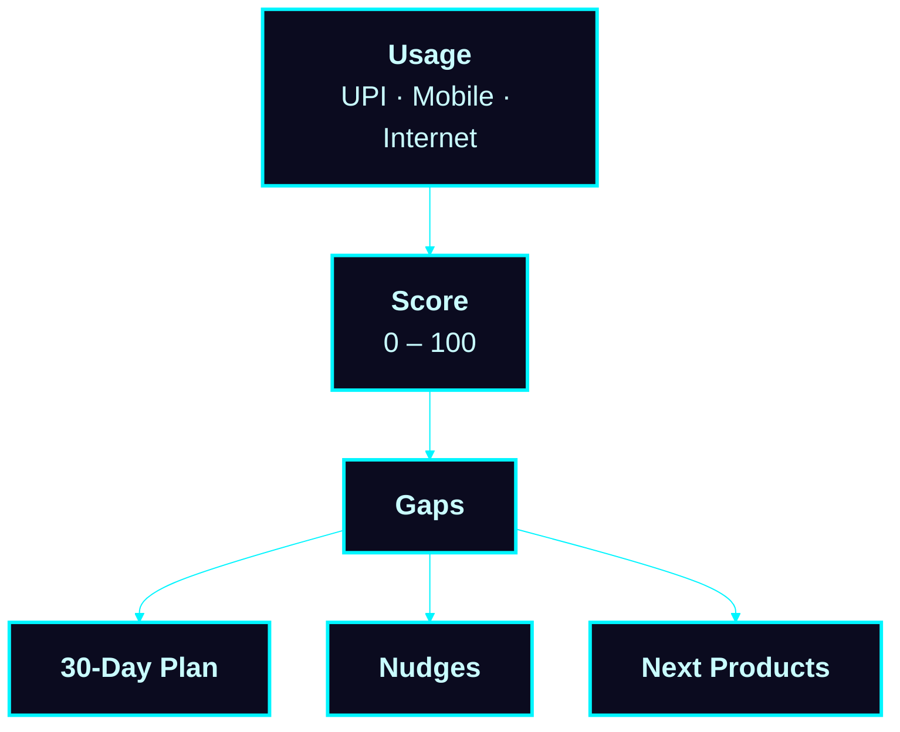

> *Don't just measure adoption. Identify the next digital action.*

</details>

<details>
<summary><b>🎉 6. Life Events & Next-Best-Action</b> · <i>signals, not certainties</i></summary>
<br>

**Signals:** Salary Hike · New Job · Marriage · Home Purchase · Travel · Education · Retirement Readiness

| Signal | Suggested action |
|---|---|
| Salary hike | Review whether to raise your monthly SIP |
| Home purchase goal | Check EMI affordability in the Simulation Lab |
| Retirement readiness | Explore the Retirement Simulator |

> Estimated signals only, not confirmed life events.

</details>

<details>
<summary><b>💬 7. AI Chatbot, Voice & Financial Coach</b> · <i>English · हिंदी · தமிழ்</i></summary>
<br>

- **Voice** input and spoken replies (browser Web Speech API)
- **Works offline** because it is rule-based
- Every answer has four parts:

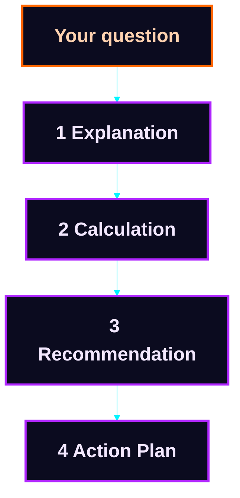

<details>
<summary>💭 Try asking</summary>
<br>

- *"How can I save more?"*
- *"Can I afford a ₹10 lakh car?"*

</details>

> A local rule-based assistant, not a connected LLM.

</details>

<details>
<summary><b>🧪 8. Simulation Lab & Financial Planner</b> · <i>don't guess, simulate</i></summary>
<br>

| Scenario | Extra SIP |
|---|---|
| A | ₹0 / month |
| B | ₹5,000 / month |
| C | ₹10,000 / month |

- **Live recalculation:** EMI, total interest, emergency fund coverage
- **Planner modules:** SIP Calculator · Wealth Forecast · Goal Planning · Retirement Simulator · Emergency Fund · Salary Hike Simulator

<details>
<summary>📈 See an illustrative projection (₹ lakh, assumed 12% p.a.)</summary>
<br>

| Year | A: ₹0 | B: ₹5,000 | C: ₹10,000 |
|---|---|---|---|
| 0 | 0.0 | 0.0 | 0.0 |
| 2 | 0.0 | 1.4 | 2.7 |
| 4 | 0.0 | 3.1 | 6.2 |
| 6 | 0.0 | 5.3 | 10.6 |
| 8 | 0.0 | 8.1 | 16.2 |
| 10 | 0.0 | 11.6 | 23.2 |

*Illustration only. Not a forecast or a promise of returns.*

</details>

</details>

<details>
<summary><b>🛡️ 9. Scam Protection</b> · <i>paste a message, get a risk level</i></summary>
<br>

Pattern-based scan for: **OTP requests · Urgency · Prize offers · Suspicious links · Remote-access apps**

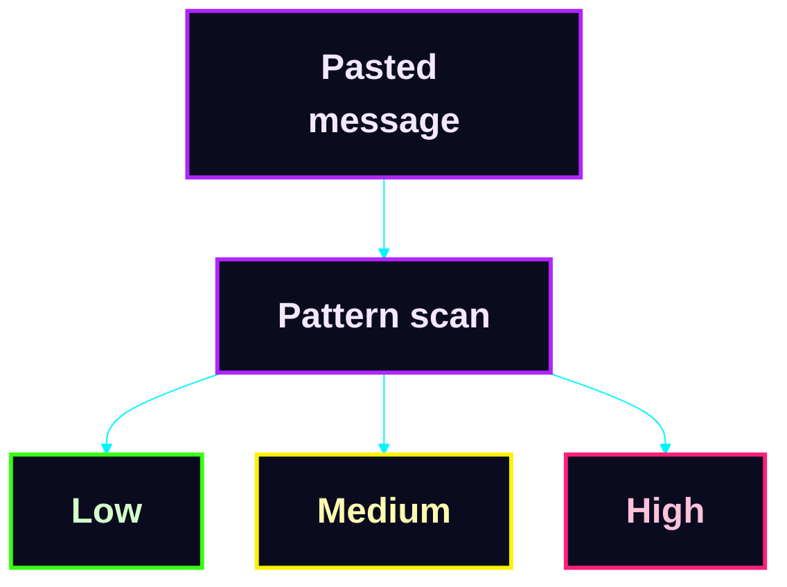

**Output:** risk level + explanation. Pattern matching, not a guarantee.

</details>

<details>
<summary><b>📷 10. Camera Banking</b> · <i>document checks in your browser</i></summary>
<br>

Checks **brightness · sharpness · document coverage**, plus best-effort OCR (Tesseract.js, needs an online library).

🔐 **Privacy:** PAN / Aadhaar numbers are always masked (`XXXX XXXX 2346`). The complete number and image are not stored.

</details>

<details>
<summary><b>🏦 11. Bank Manager & Executive Intelligence</b> · <i>the institutional view</i></summary>
<br>

| Manager Dashboard | Executive Intelligence |
|---|---|
| City-wise digital adoption heatmap | SIP adoption prediction |
| Low-adoption finder | Insurance adoption prediction |
| High-value finder | Investment / insurance opportunities |
| K-means segmentation (3+ accounts) | Revenue opportunity estimate |
| | Fraud monitoring · Campaign tracking |

> Based only on accounts registered in the **same browser**. Predictions are fixed-weight heuristics, not trained models.

</details>

---

## 🛠️ Technology Stack

**Runs entirely in the browser.**

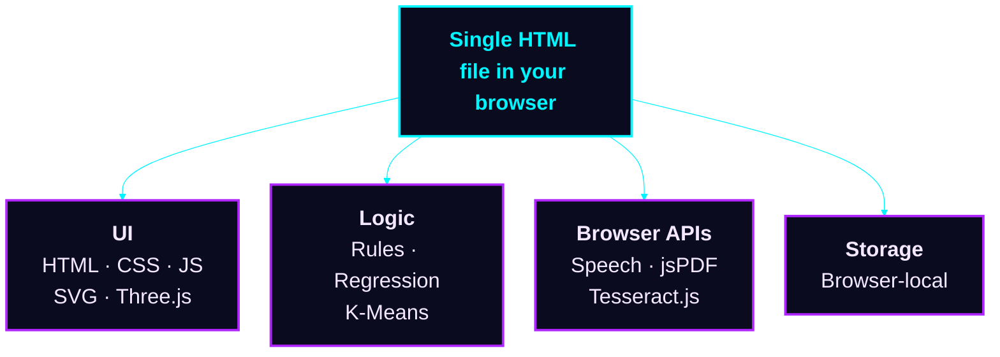

| Layer | Technology |
|---|---|
| Frontend | HTML + CSS + JavaScript |
| Visualization | SVG + Three.js |
| PDF reports | jsPDF |
| OCR | Tesseract.js (best-effort) |
| Voice | Web Speech API |
| Storage | Browser storage |
| Logic | Rule-based + heuristics |
| ML | Linear Regression · K-Means Clustering |
| Prediction | Fixed-weight logistic score (heuristic) |
| Chatbot | Local rule-based assistant |

<details>
<summary><b>📐 Formulas used</b></summary>
<br>

```text
Savings Rate = (Income − Expenses) ÷ Income × 100
DTI          = Total Monthly EMI ÷ Monthly Income × 100
Net Worth    = Cash + Investments − Loans
EMI          = P × r × (1 + r)^n ÷ ((1 + r)^n − 1)
```

</details>

<details>
<summary><b>⚠️ Current limitations (stated up front)</b></summary>
<br>

- No backend / database; data is browser-local
- No production banking integration
- Loan / credit outputs are simulations
- Life-event outputs are estimates
- Propensity models are not trained on real outcomes
- Chatbot is rule-based, not an LLM
- OCR is best-effort and needs an online library
- Manager / Executive views cover same-browser accounts only
- Some features remain future scope

*Technical honesty is a design choice.*

</details>

---

## 🚀 Roadmap: MANSHORA 2.0

*Future scope only. Nothing below the first step is implemented today.*

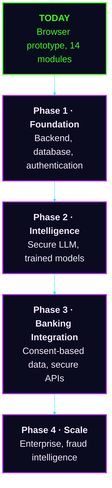

<details>
<summary><b>🔎 See what's inside each phase</b></summary>
<br>

| Phase | What it adds |
|---|---|
| **1 · Foundation** | Node.js backend · Secure database · Authentication · Server-side security |
| **2 · Intelligence** | Secure LLM integration · Trained propensity models · Real outcome-based ML · Advanced personalization |
| **3 · Banking Integration** | Consent-based transaction data · Secure banking APIs · Real digital adoption signals · Real-time insights |
| **4 · Scale** | Enterprise deployment · Advanced fraud intelligence · Personalized journeys · Responsible Agentic AI |

</details>

**Progress tracker**

- [x] Browser-based prototype with 14 modules
- [ ] Phase 1: Foundation
- [ ] Phase 2: Intelligence
- [ ] Phase 3: Banking Integration
- [ ] Phase 4: Scale

---

## 🎬 Project Demonstration

| | |
|---|---|
| 📓 **Prototype notebook** | [Open in Google Colab](https://colab.research.google.com/drive/1qdm39UOnB7qQUSCbRjnKjOZniCnCs9MQ#scrollTo=BgxUpgUyj1BP) |
| 🌐 **Web app** | Single self-contained HTML file. Open it in any modern browser. |

<details>
<summary><b>▶️ How to run it (3 steps)</b></summary>
<br>

1. **Download** the single `.html` file
2. **Double-click** it to open in Chrome, Edge, Firefox or Safari
3. **Explore:** register a demo account, add a month of data, then try the Council, Chatbot and Simulation Lab

</details>

<!-- Add screenshots / demo GIF here -->

---

## 📜 Disclaimer

MANSHORA provides **educational and simulated financial insights**. Recommendations are **not** guaranteed financial advice, loan approval, investment advice, or credit decisions. Demo visuals are illustrative mockups.

---

<div align="center">

**Mansi Kushwaha** × **Sheetal**

*Analyze. Understand. Predict. Act.*

**MANSHORA · Insight Engineered for Impact**

</div>
