<a id="top"></a>

<div align="center">


### **From Financial Data to Intelligent Decisions**


[](https://colab.research.google.com/drive/1qdm39UOnB7qQUSCbRjnKjOZniCnCs9MQ#scrollTo=BgxUpgUyj1BP)

*Created by **Mansi Kushwaha** × **Sheetal** · Evolved from **DigiMentor AI 3.0***

</div>

---

## 🧭 Quick Navigation

<div align="center">

[](#quick-look)
[](#roles)
[](#problem)
[](#ecosystem)
[](#how-it-works)
[](#trust)
[](#features)
[](#tech)
[](#roadmap)
[](#demo)
[](#faq)
[](#disclaimer)

</div>

> 👆 **Tap any badge to jump to that section.**

---

<a id="quick-look"></a>

## ⚡ Quick Look

<div align="center">

| 🧩 | 🤖 | 🔒 | 🌐 |
|:---:|:---:|:---:|:---:|
| **14** modules | **14** AI agents | **0** fake data | **0** backend |
| Customer + Bank | Council synthesis | Real inputs only | Runs in browser |

</div>

> **Financial data exists. Financial understanding doesn't.**
> MANSHORA is the intelligence layer that closes that gap for both customers and banks.

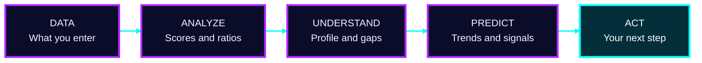

<div align="right"><a href="#top">⬆ back to top</a></div>

---

<a id="roles"></a>

## 🎯 Pick Your Role

> 👇 **Click your role** to see what MANSHORA gives you.

<details>
<summary><b>👤 I am a Customer</b></summary>
<br>

- 💯 Financial health score
- 📅 Monthly tracking
- 🧠 AI-style insights
- 🧪 Simulations and goals
- 📱 Digital adoption analysis
- 💬 Financial chatbot
- 🎉 Life-event signals

**Start here →** [Financial Health](#feature-2) · [Chatbot](#feature-7) · [Simulation Lab](#feature-8)

</details>

<details>
<summary><b>🏦 I am a Bank Manager</b></summary>
<br>

- 🧬 Customer segmentation
- 📱 Digital adoption analysis
- ⚠️ Risk signals
- 🎁 Product opportunities
- 📈 Investment and insurance opportunities
- 📣 Campaign monitoring
- 🧭 Executive intelligence

**Start here →** [AI Council](#feature-4) · [Digital Adoption](#feature-5) · [Manager Dashboard](#feature-11)

</details>

<details>
<summary><b>🧑‍⚖️ I am a Hackathon Judge</b></summary>
<br>

- ✅ Theme 2: **Digital Adoption** → [module 5](#feature-5)
- ✅ Honest limitations → [read them](#limitations)
- ✅ Prototype → [Google Colab](https://colab.research.google.com/drive/1qdm39UOnB7qQUSCbRjnKjOZniCnCs9MQ#scrollTo=BgxUpgUyj1BP)
- ✅ Future scope → [Roadmap](#roadmap)

</details>

---

## 🛤️ Our Journey

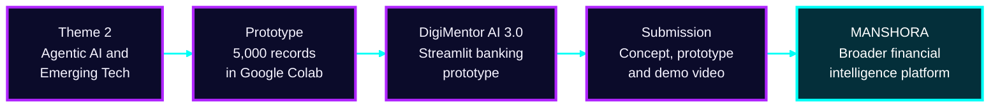

> 🌱 We chose not to stop at the idea phase. The prototype became the foundation for a broader platform.

---

<a id="problem"></a>

## ⚠️ The Problem

<details open>
<summary><b>👤 Customers have data, not answers</b></summary>
<br>

- ❓ Am I saving enough?
- ❓ Can I afford a loan?
- ❓ How much emergency fund do I need?
- ❓ Should I invest more?
- ❓ How well am I using digital banking?
- ❓ Which goal should I prioritize?

**Result:** fragmented financial information.

</details>

<details open>
<summary><b>🏦 Banks have signals, not next actions</b></summary>
<br>

- 📉 Digital adoption gaps
- 🧩 Customer segments
- 🎁 Product opportunities
- 🤝 Engagement opportunities
- ⚠️ Financial risk signals
- 🎯 Next-best actions

**Result:** fragmented customer signals.

</details>

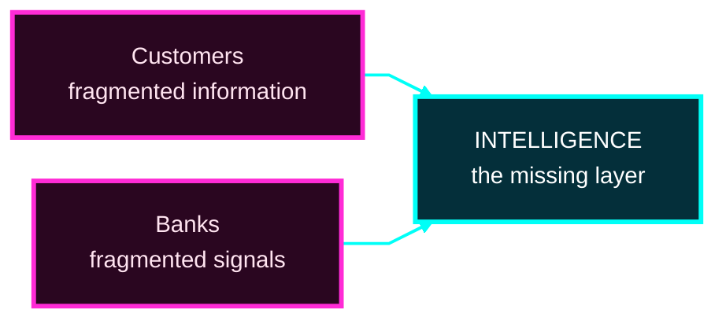

<div align="right"><a href="#top">⬆ back to top</a></div>

---

<a id="ecosystem"></a>

## 🧩 Product Ecosystem

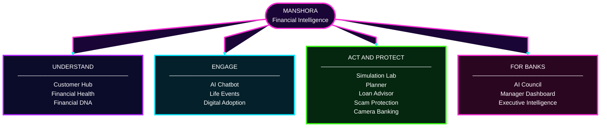

---

<a id="how-it-works"></a>

## ⚙️ How It Works

### 🔄 End-to-end working flow

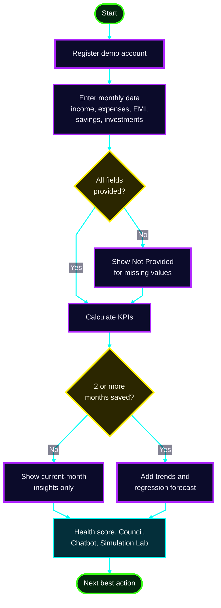

### 🗣️ Who talks to whom

```mermaid
%%{init: {'theme':'base','themeVariables':{'fontSize':'15px','fontFamily':'Arial, Helvetica, sans-serif','primaryColor':'#0b0b2a','primaryTextColor':'#ffffff','primaryBorderColor':'#00fff7','textColor':'#ffffff','lineColor':'#00fff7','actorBkg':'#0b0b2a','actorBorder':'#00fff7','actorTextColor':'#ffffff','actorLineColor':'#b026ff','signalColor':'#00fff7','signalTextColor':'#ffffff','labelBoxBkgColor':'#0b0b2a','labelBoxBorderColor':'#00fff7','labelTextColor':'#ffffff','loopTextColor':'#ffffff','noteBkgColor':'#2b2600','noteTextColor':'#ffffff','noteBorderColor':'#fff200','activationBkgColor':'#042f3a','activationBorderColor':'#00fff7','sequenceNumberColor':'#0b0b2a','background':'#0b0b2a'},'sequence':{'actorMargin':60,'messageMargin':34,'boxMargin':10,'mirrorActors':false,'width':170,'height':48}}}%%
sequenceDiagram
    autonumber
    actor U as Customer
    participant A as MANSHORA App
    participant L as Local Logic
    participant S as Browser Storage
    rect rgb(11, 11, 42)
        U->>A: Add this month's data
        A->>S: Save month, keep history
        A->>L: Run formulas and rules
        L-->>A: Score, gaps, signals
        A-->>U: Dashboard and next action
        U->>A: Ask the chatbot a question
        A->>L: Match rule, calculate
        L-->>A: Explain, Calculate, Recommend, Plan
        A-->>U: Four-part answer
    end
```

<div align="right"><a href="#top">⬆ back to top</a></div>

---

<a id="trust"></a>

## 🔒 Trust by Design

> **One rule we never break: no fake data.**

| ✅ We do | ❌ We never |
|---|---|
| Calculate insights from available inputs | Invent customer numbers |
| Show missing info as **"Not Provided"** | Hard-code financial outcomes |
| Label every simulated output | Present simulations as facts |
| Frame recommendations as educational | Promise guaranteed advice |

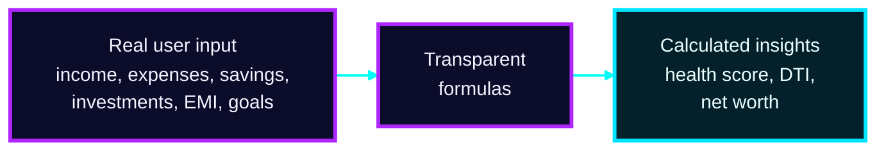

*Transparency is a feature.*

---

<a id="features"></a>

## 🔬 Feature Deep Dive

> 👇 **Click any feature to open it.** Each one is short and ends with an honest note on what it is and isn't.

<a id="feature-1"></a>

<details>
<summary><b>📅 1. Monthly Financial Memory</b> · <i>your story, month by month</i></summary>
<br>

- Each month stores **income, expenses, EMI, savings and investments**
- Add only the new month; earlier months are **retained, never overwritten**
- History powers trends, KPIs, forecasts and recommendations
- Forecasts use **linear regression** on saved history

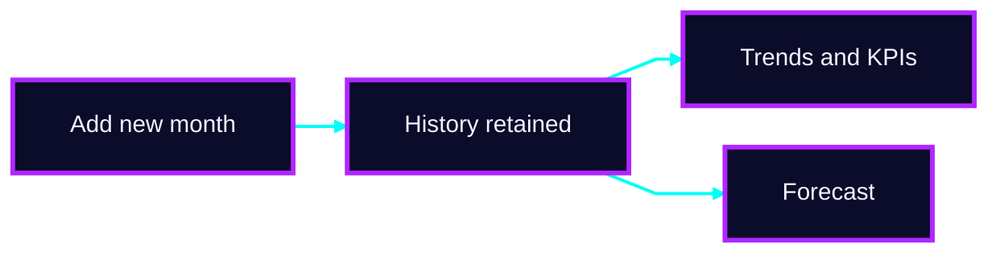

</details>

<a id="feature-2"></a>

<details>
<summary><b>💯 2. Financial Health Dashboard</b> · <i>a 100-point score</i></summary>
<br>

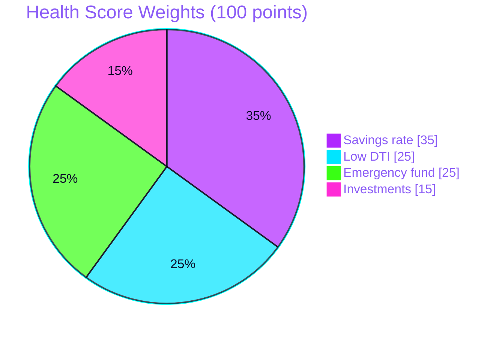

**10 KPIs:** Health Score · Income · Expenses · DTI · Savings · Savings Rate · Investments · Outstanding Loans · Net Worth · Digital Adoption

**Working condition:** each component earns points, and the four parts add up to the score.

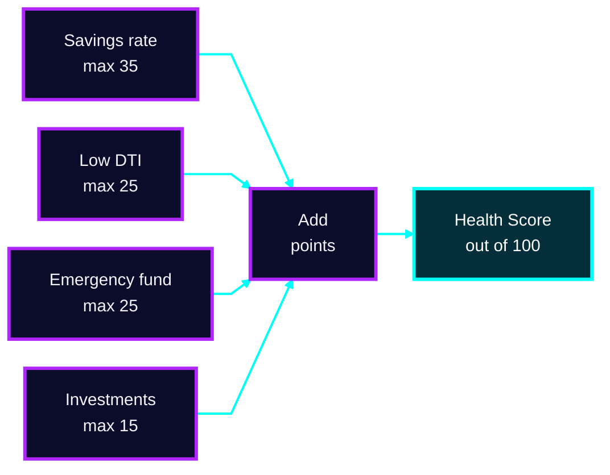

</details>

<a id="feature-3"></a>

<details>
<summary><b>🧬 3. Financial DNA and Digital Twin</b> · <i>a profile, not isolated metrics</i></summary>
<br>

- Six dimensions: **Saver · Investor · Borrower · Digital User · Protector · Planner**
- **Risk appetite:** Conservative / Moderate / Aggressive
- **Digital adoption gaps** across UPI, Mobile Banking and Internet Banking
- Searchable in the Customer Hub by name, ID or city

</details>

<a id="feature-4"></a>

<details>
<summary><b>🤖 4. AI Council</b> · <i>14 agents, one synthesis</i></summary>
<br>

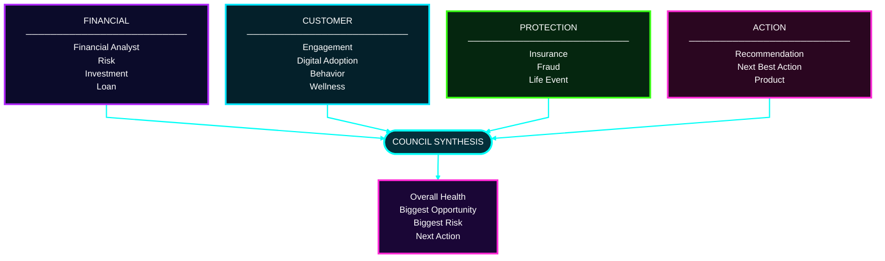

Each agent returns **Status · Recommendation · Confidence · Reason**.

> Rule-based logic and heuristics only. No hidden chain-of-thought, no claim of autonomous LLM reasoning.

</details>

<a id="feature-5"></a>

<details>
<summary><b>📱 5. Digital Adoption Intelligence</b> · <i>SBI GFF Theme 2</i></summary>
<br>

- **Digital Adoption Score (0–100)** from UPI, mobile and internet banking usage
- **Gaps** from missing or low usage
- **30-Day Action Plan**, **Personalized Nudges**, **Potential Next Products**

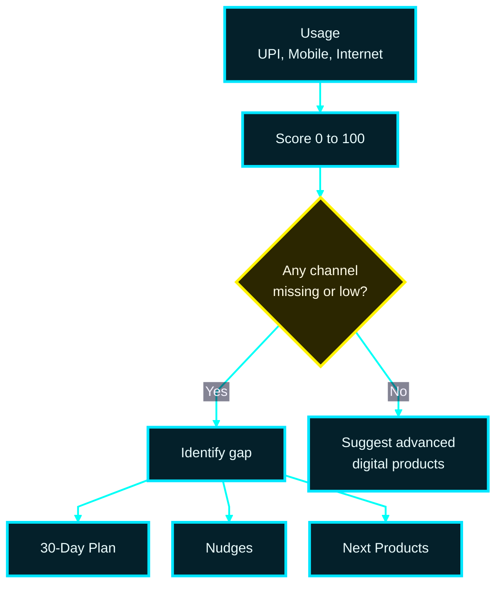

> *Don't just measure adoption. Identify the next digital action.*

</details>

<a id="feature-6"></a>

<details>
<summary><b>🎉 6. Life Events and Next-Best-Action</b> · <i>signals, not certainties</i></summary>
<br>

**Signals:** Salary Hike · New Job · Marriage · Home Purchase · Travel · Education · Retirement Readiness

| Signal | Suggested action |
|---|---|
| Salary hike | Review whether to raise your monthly SIP |
| Home purchase goal | Check EMI affordability in the Simulation Lab |
| Retirement readiness | Explore the Retirement Simulator |

> Estimated signals only, not confirmed life events.

</details>

<a id="feature-7"></a>

<details>
<summary><b>💬 7. AI Chatbot, Voice and Financial Coach</b> · <i>English · हिंदी · தமிழ்</i></summary>
<br>

- **Voice** input and spoken replies (browser Web Speech API)
- **Works offline** because it is rule-based
- Every answer has four parts:

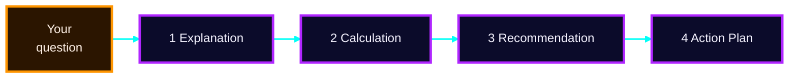

**💭 Try asking:** *"How can I save more?"* · *"Can I afford a ₹10 lakh car?"*

<details>
<summary>🔍 Example of a four-part answer (illustrative)</summary>
<br>

| Part | Example |
|---|---|
| **Explanation** | A car loan adds a fixed EMI, which raises your DTI. |
| **Calculation** | Loan ₹10 lakh at 9% for 5 years gives an EMI of about ₹20,758. |
| **Recommendation** | Compare that EMI with your income before deciding. |
| **Action Plan** | Open the Simulation Lab, try different tenures, then recheck your health score. |

*Numbers above are an example, not advice.*

</details>

> A local rule-based assistant, not a connected LLM.

</details>

<a id="feature-8"></a>

<details>
<summary><b>🧪 8. Simulation Lab and Financial Planner</b> · <i>don't guess, simulate</i></summary>
<br>

| Scenario | Extra SIP |
|:-:|---|
| A | ₹0 / month |
| B | ₹5,000 / month |
| C | ₹10,000 / month |

- **Live recalculation:** EMI, total interest, emergency fund coverage
- **Planner modules:** SIP Calculator · Wealth Forecast · Goal Planning · Retirement Simulator · Emergency Fund · Salary Hike Simulator

<details>
<summary>📈 See an illustrative projection (₹ lakh, assumed 12% p.a.)</summary>
<br>

| Year | A: ₹0 | B: ₹5,000 | C: ₹10,000 |
|:-:|:-:|:-:|:-:|
| 0 | 0.0 | 0.0 | 0.0 |
| 2 | 0.0 | 1.4 | 2.7 |
| 4 | 0.0 | 3.1 | 6.2 |
| 6 | 0.0 | 5.3 | 10.6 |
| 8 | 0.0 | 8.1 | 16.2 |
| 10 | 0.0 | 11.6 | 23.2 |

*Illustration only. Not a forecast or a promise of returns.*

</details>

</details>

<a id="feature-9"></a>

<details>
<summary><b>🛡️ 9. Scam Protection</b> · <i>paste a message, get a risk level</i></summary>
<br>

Pattern-based scan for: **OTP requests · Urgency · Prize offers · Suspicious links · Remote-access apps**

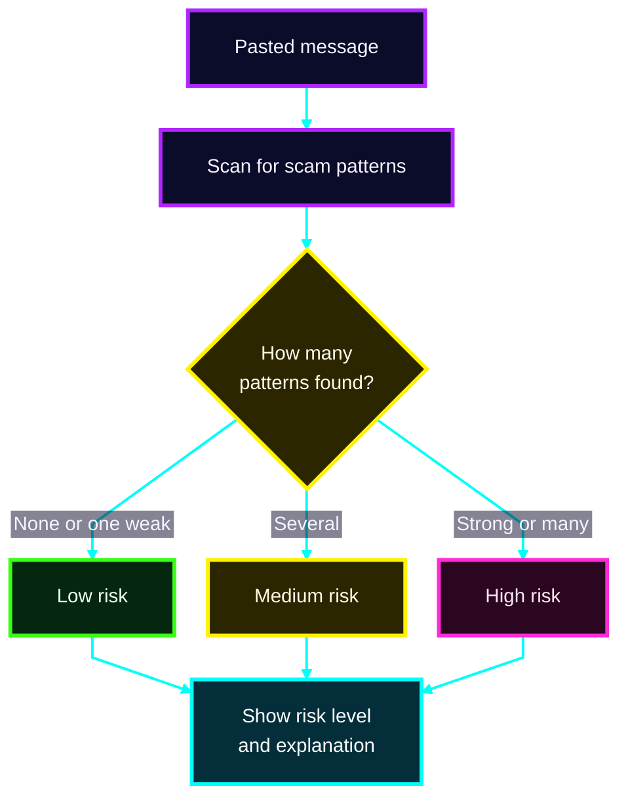

**Output:** risk level + explanation. Pattern matching, not a guarantee.

</details>

<a id="feature-10"></a>

<details>
<summary><b>📷 10. Camera Banking</b> · <i>document checks in your browser</i></summary>
<br>

Checks **brightness · sharpness · document coverage**, plus best-effort OCR (Tesseract.js, needs an online library).

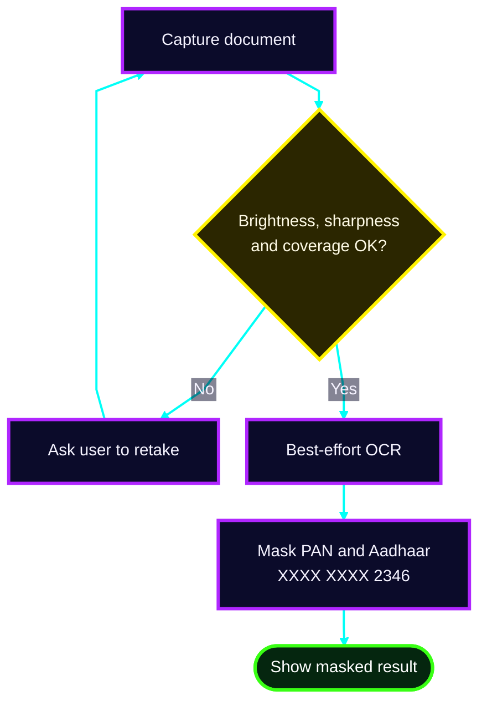

🔐 **Privacy:** PAN and Aadhaar numbers are always masked. The complete number and image are not stored.

</details>

<a id="feature-11"></a>

<details>
<summary><b>🏦 11. Bank Manager and Executive Intelligence</b> · <i>the institutional view</i></summary>
<br>

| Manager Dashboard | Executive Intelligence |
|---|---|
| City-wise digital adoption heatmap | SIP adoption prediction |
| Low-adoption finder | Insurance adoption prediction |
| High-value finder | Investment and insurance opportunities |
| K-means segmentation (3+ accounts) | Revenue opportunity estimate |
| | Fraud monitoring · Campaign tracking |

> Based only on accounts registered in the **same browser**. Predictions are fixed-weight heuristics, not trained models.

</details>

<div align="right"><a href="#top">⬆ back to top</a></div>

---

<a id="tech"></a>

## 🛠️ Technology Stack

**Runs entirely in the browser.**

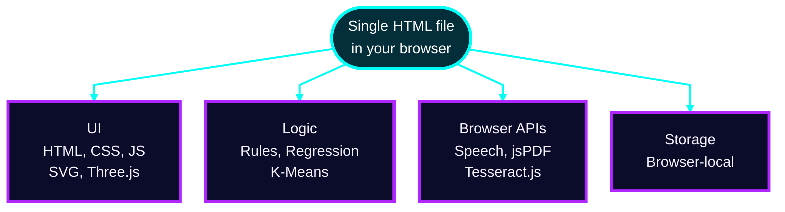

| Layer | Technology |
|---|---|
| Frontend | HTML + CSS + JavaScript |
| Visualization | SVG + Three.js |
| PDF reports | jsPDF |
| OCR | Tesseract.js (best-effort) |
| Voice | Web Speech API |
| Storage | Browser storage |
| Logic | Rule-based + heuristics |
| ML | Linear Regression · K-Means Clustering |
| Prediction | Fixed-weight logistic score (heuristic) |
| Chatbot | Local rule-based assistant |

### 📐 Formulas used

<details>
<summary><b>Open the formulas</b></summary>
<br>

```text
Savings Rate = (Income - Expenses) / Income x 100
DTI          = Total Monthly EMI / Monthly Income x 100
Net Worth    = Cash + Investments - Loans
EMI          = P x r x (1 + r)^n / ((1 + r)^n - 1)
```

<details>
<summary>🧮 Worked example (illustrative numbers)</summary>
<br>

| Input | Value |
|---|---|
| Monthly income | ₹60,000 |
| Monthly expenses | ₹42,000 |
| Total monthly EMI | ₹12,000 |

| Result | Calculation | Answer |
|---|---|---|
| Savings Rate | (60,000 − 42,000) / 60,000 × 100 | **30%** |
| DTI | 12,000 / 60,000 × 100 | **20%** |

*Example only. Not a real customer.*

</details>

</details>

<a id="limitations"></a>

### ⚠️ Current limitations

<details>
<summary><b>Stated up front (click to read)</b></summary>
<br>

- No backend or database; data is browser-local
- No production banking integration
- Loan and credit outputs are simulations
- Life-event outputs are estimates
- Propensity models are not trained on real outcomes
- Chatbot is rule-based, not an LLM
- OCR is best-effort and needs an online library
- Manager and Executive views cover same-browser accounts only
- Some features remain future scope

*Technical honesty is a design choice.*

</details>

---

<a id="roadmap"></a>

## 🚀 Roadmap: MANSHORA 2.0

*Future scope only. Nothing below the first step is implemented today.*

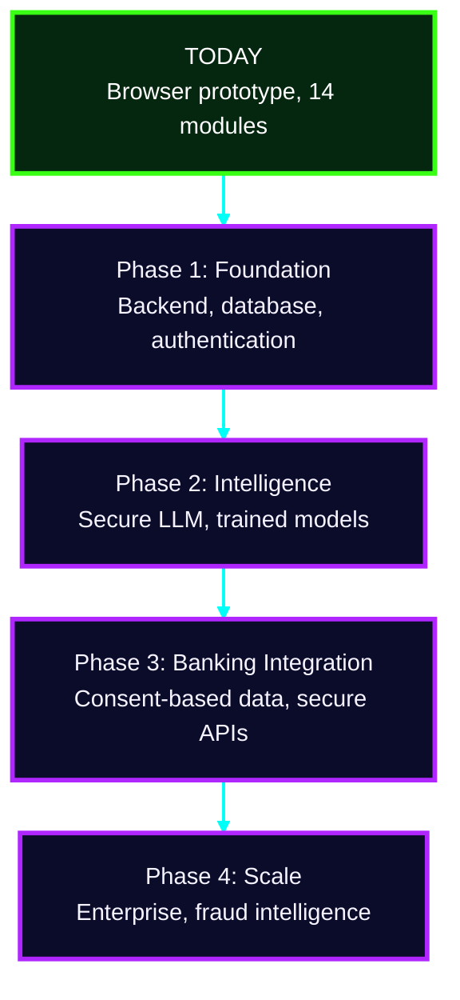

<details>
<summary><b>🔎 See what's inside each phase</b></summary>
<br>

| Phase | What it adds |
|---|---|
| **1 · Foundation** | Node.js backend · Secure database · Authentication · Server-side security |
| **2 · Intelligence** | Secure LLM integration · Trained propensity models · Real outcome-based ML · Advanced personalization |
| **3 · Banking Integration** | Consent-based transaction data · Secure banking APIs · Real digital adoption signals · Real-time insights |
| **4 · Scale** | Enterprise deployment · Advanced fraud intelligence · Personalized journeys · Responsible Agentic AI |

</details>

**Progress tracker**

- [x] Browser-based prototype with 14 modules
- [ ] Phase 1: Foundation
- [ ] Phase 2: Intelligence
- [ ] Phase 3: Banking Integration
- [ ] Phase 4: Scale

<div align="right"><a href="#top">⬆ back to top</a></div>

---

<a id="demo"></a>

## 🎬 Project Demonstration

| | |
|---|---|
| 📓 **Prototype notebook** | [Open in Google Colab](https://colab.research.google.com/drive/1qdm39UOnB7qQUSCbRjnKjOZniCnCs9MQ#scrollTo=BgxUpgUyj1BP) |
| 🌐 **Web app** | Single self-contained HTML file. Open it in any modern browser. |

<details>
<summary><b>▶️ How to run it (3 steps)</b></summary>
<br>

1. **Download** the single `.html` file
2. **Double-click** it to open in Chrome, Edge, Firefox or Safari
3. **Explore:** register a demo account, add a month of data, then try the Council, Chatbot and Simulation Lab

</details>

<details>
<summary><b>🧭 Suggested 5-minute demo path</b></summary>
<br>

| Step | Go to | What to notice |
|:-:|---|---|
| 1 | Register | Account is created in your browser only |
| 2 | Add a month | Missing values show as "Not Provided" |
| 3 | Health Dashboard | Score and 10 KPIs update from your input |
| 4 | AI Council | 14 agents feed one synthesis |
| 5 | Chatbot | Four-part answer, works offline |
| 6 | Simulation Lab | Compare scenarios A, B and C |

</details>

<!-- Add screenshots / demo GIF here -->

---

<a id="faq"></a>

## ❓ FAQ

<details>
<summary><b>Is any data sent to a server?</b></summary>
<br>

No. There is no backend. Data stays in your browser's local storage.

</details>

<details>
<summary><b>Is the AI Council a real LLM?</b></summary>
<br>

No. It is rule-based logic and heuristics, and the README says so on purpose.

</details>

<details>
<summary><b>Are the predictions trained models?</b></summary>
<br>

No. They are fixed-weight heuristics. Trained models are planned for Phase 2.

</details>

<details>
<summary><b>Can it approve a loan?</b></summary>
<br>

No. Loan and credit outputs are simulations for education only.

</details>

---

<a id="disclaimer"></a>

## 📜 Disclaimer

MANSHORA provides **educational and simulated financial insights**. Recommendations are **not** guaranteed financial advice, loan approval, investment advice, or credit decisions. Demo visuals are illustrative mockups.

---

<div align="center">

**Mansi Kushwaha** × **Sheetal**

*Analyze. Understand. Predict. Act.*

**MANSHORA · Insight Engineered for Impact**

<a href="#top">⬆ Back to top</a>

</div>
