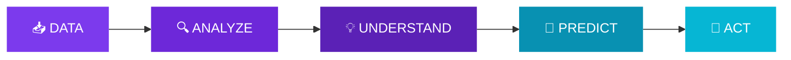
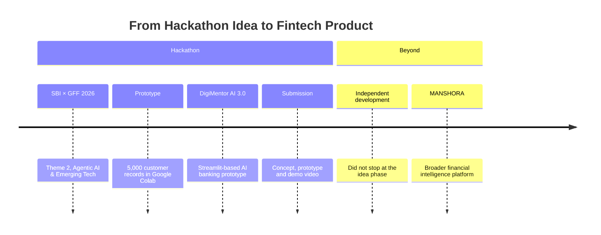
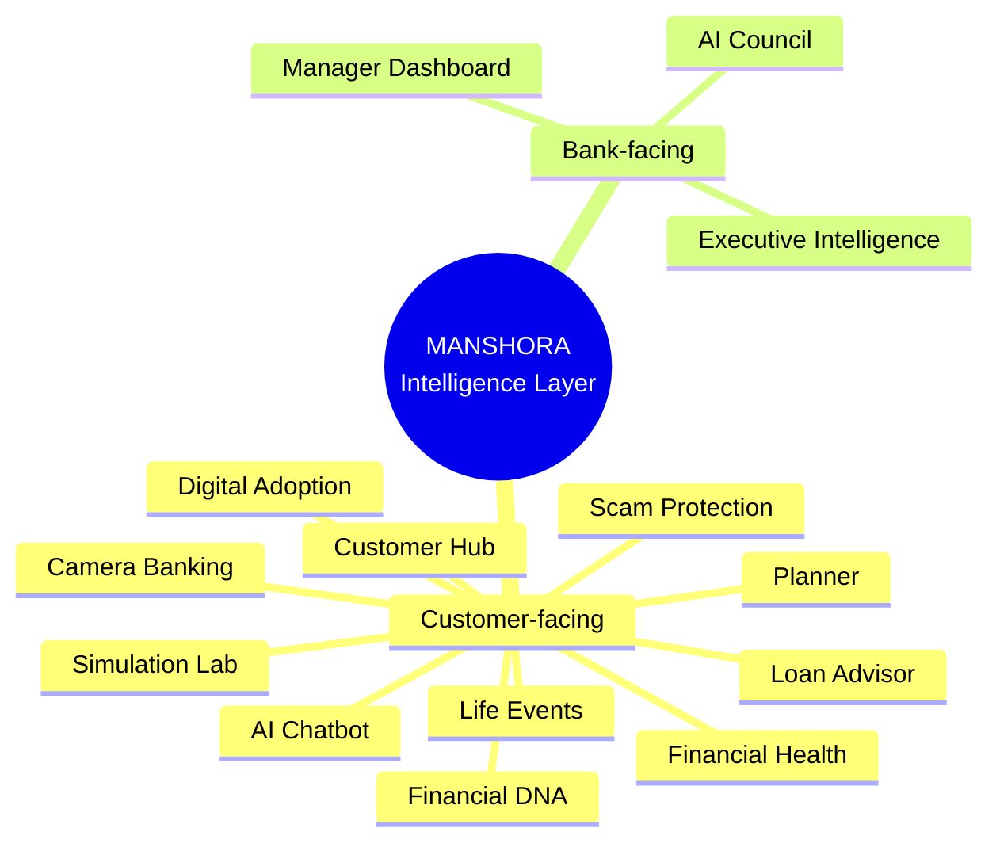
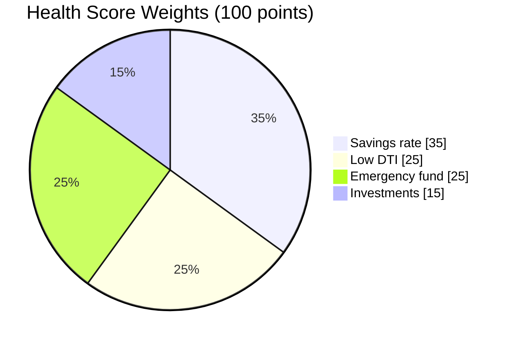
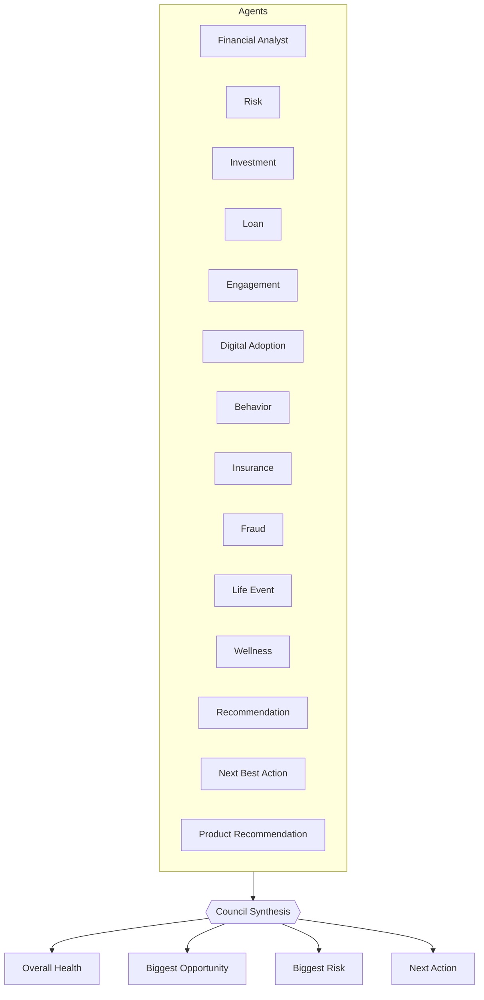
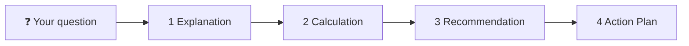
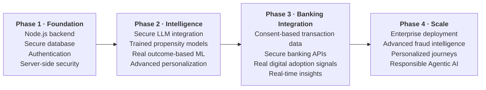

<div align="center">


**From Financial Data to Intelligent Decisions**


[**Overview**](#-overview) · [**Journey**](#-our-journey) · [**Problem**](#-the-problem) · [**Ecosystem**](#-product-ecosystem) · [**Features**](#-feature-deep-dive-click-to-expand) · [**Tech**](#-technology-stack) · [**Roadmap**](#-roadmap-manshora-20) · [**Demo**](#-project-demonstration)

*Created by **Mansi Kushwaha** × **Sheetal** · Evolved from **DigiMentor AI 3.0***

</div>

---

## 🧭 Overview

**MANSHORA** is a financial intelligence platform that turns raw financial data into clear understanding and concrete next steps. One intelligence layer serves both **customers** and **banks**, and it runs entirely in the browser with no backend.



<table>
<tr>
<td width="50%" valign="top">

### 👤 For Customers
- Financial health score
- Monthly financial tracking
- AI-style insights
- Simulations and goal planning
- Digital adoption analysis
- Financial chatbot
- Life-event signals

</td>
<td width="50%" valign="top">

### 🏦 For Banks / Managers
- Customer segmentation
- Digital adoption analysis
- Risk signals
- Product opportunities
- Investment / insurance opportunities
- Campaign monitoring
- Executive intelligence

</td>
</tr>
</table>

---

## 🛤️ Our Journey



> We chose not to stop at the idea phase. We used the prototype as a foundation and expanded it into a broader financial intelligence platform.

---

## ⚠️ The Problem

**Financial data exists. Financial understanding doesn't.**

<details>
<summary><b>👤 Customer problem</b> (click to expand)</summary>
<br>

People often struggle to answer:

- Am I saving enough?
- Can I afford a loan?
- How much emergency fund do I need?
- Should I invest more?
- How well am I using digital banking?
- What financial goal should I prioritize?

**Result:** fragmented financial information.

</details>

<details>
<summary><b>🏦 Banking problem</b> (click to expand)</summary>
<br>

Banks hold data but need better ways to identify:

- Digital adoption gaps
- Customer segments
- Product opportunities
- Engagement opportunities
- Financial risk signals
- Next-best actions

**Result:** fragmented customer signals.

</details>

> **The missing layer is intelligence.**

---

## 🧩 Product Ecosystem



---

## 🔒 Trust by Design

> **One rule we never break: no fake data.**

| ✅ We do | ❌ We never |
|---|---|
| Calculate insights from available inputs | Invent customer numbers |
| Show missing info as **"Not Provided"** | Hard-code financial outcomes |
| Label every simulated output | Present simulations as facts |
| Frame recommendations as educational | Promise guaranteed advice |

**Real user input** (income, expenses, savings, investments, EMI, goals, digital banking usage) → **calculated insights** (health score, savings rate, DTI, net worth, digital adoption score).

*Transparency is a feature.*

---

## 🔬 Feature Deep Dive (click to expand)

<details>
<summary><b>📅 1. Monthly Financial Memory</b></summary>
<br>

Your financial story, month by month (Jan → Dec).

- Each month stores **income, expenses, EMI, savings and investments**
- Users add only the new month; earlier months are **retained, never overwritten**
- History powers trends, KPIs, forecasts and recommendations
- Forecasts use **linear regression** on saved history

</details>

<details>
<summary><b>💯 2. Financial Health Dashboard</b></summary>
<br>

A 100-point **Health Score** built from user-entered data.



**9 KPIs:** Health Score · Income · Expenses · DTI · Savings · Savings Rate · Investments · Outstanding Loans · Net Worth (plus Digital Adoption)

</details>

<details>
<summary><b>🧬 3. Financial DNA & Digital Twin</b></summary>
<br>

A multidimensional profile instead of isolated metrics.

- Six dimensions: **Saver · Investor · Borrower · Digital User · Protector · Planner**
- **Risk appetite** per customer: Conservative / Moderate / Aggressive
- **Digital adoption gaps** flagged across UPI, Mobile Banking and Internet Banking
- Searchable in the Customer Hub by name, ID or city

</details>

<details>
<summary><b>🤖 4. AI Council: 14 agents, one synthesis</b></summary>
<br>



Each agent returns **Status · Recommendation · Confidence · Reason**.

> Rule-based logic and heuristics only. It does not expose hidden chain-of-thought or claim autonomous LLM reasoning.

</details>

<details>
<summary><b>📱 5. Digital Adoption Intelligence</b></summary>
<br>

Tied directly to SBI GFF Theme 2.

- **Digital Adoption Score (0–100)** from UPI, mobile banking and internet banking usage
- **Gaps** from missing or low usage
- **30-Day Action Plan**, **Personalized Nudges**, **Potential Next Products**

> *Don't just measure adoption. Identify the next digital action.*

</details>

<details>
<summary><b>🎉 6. Life Events & Next-Best-Action</b></summary>
<br>

**Signals:** Salary Hike · New Job · Marriage · Home Purchase · Travel · Education · Retirement Readiness

`Financial change + stated goal` → `Signal detection` → `Estimated life event` → `Relevant action`

| Signal | Suggested action |
|---|---|
| Salary hike | Review whether to raise your monthly SIP |
| Home purchase goal | Check EMI affordability in the Simulation Lab |
| Retirement readiness | Explore the Retirement Simulator |

> Estimated signals only, not confirmed life events.

</details>

<details>
<summary><b>💬 7. AI Chatbot, Voice & Financial Coach</b></summary>
<br>

- **Languages:** English · हिंदी · தமிழ்
- **Voice** input and spoken replies (browser Web Speech API)
- **Works offline** because it is rule-based
- Every answer has four parts:



Try: *"How can I save more?"* · *"Can I afford a ₹10 lakh car?"*

> A local rule-based assistant, not a connected LLM.

</details>

<details>
<summary><b>🧪 8. Simulation Lab & Financial Planner</b></summary>
<br>

*Don't guess. Simulate.*

| Scenario | Extra SIP |
|---|---|
| A | ₹0 / month |
| B | ₹5,000 / month |
| C | ₹10,000 / month |

- **Live recalculation:** EMI, total interest, emergency fund coverage
- **Planner modules:** SIP Calculator · Wealth Forecast · Goal Planning · Retirement Simulator · Emergency Fund · Salary Hike Simulator

<details>
<summary>📈 Illustrative projection (₹ lakh, assumed 12% p.a.)</summary>
<br>

| Year | A: ₹0 | B: ₹5,000 | C: ₹10,000 |
|---|---|---|---|
| 0 | 0.0 | 0.0 | 0.0 |
| 2 | 0.0 | 1.4 | 2.7 |
| 4 | 0.0 | 3.1 | 6.2 |
| 6 | 0.0 | 5.3 | 10.6 |
| 8 | 0.0 | 8.1 | 16.2 |
| 10 | 0.0 | 11.6 | 23.2 |

*Illustration only. Not a forecast or a promise of returns.*

</details>

</details>

<details>
<summary><b>🛡️ 9. Scam Protection</b></summary>
<br>

Pattern-based scan of a pasted message for: **OTP requests · Urgency · Prize offers · Suspicious links · Remote-access apps**

**Output:** risk level + explanation. Pattern matching, not a guarantee.

</details>

<details>
<summary><b>📷 10. Camera Banking</b></summary>
<br>

In-browser document photo checks: **brightness · sharpness · document coverage · best-effort OCR** (Tesseract.js, needs an online library).

🔐 **Privacy:** PAN / Aadhaar numbers are always masked (`XXXX XXXX 2346`). The complete number and image are not stored.

</details>

<details>
<summary><b>🏦 11. Bank Manager & Executive Intelligence</b></summary>
<br>

| Manager Dashboard | Executive Intelligence |
|---|---|
| City-wise digital adoption heatmap | SIP adoption prediction |
| Low-adoption finder | Insurance adoption prediction |
| High-value finder | Investment / insurance opportunities |
| K-means segmentation (3+ accounts) | Revenue opportunity estimate |
| | Fraud monitoring · Campaign tracking |

> Based only on accounts registered in the **same browser**. Predictions are fixed-weight heuristics, not trained models.

</details>

---

## 🛠️ Technology Stack

**Runs entirely in the browser.**

| Layer | Technology |
|---|---|
| Frontend | HTML + CSS + JavaScript |
| Visualization | SVG + Three.js |
| PDF reports | jsPDF |
| OCR | Tesseract.js (best-effort) |
| Voice | Web Speech API |
| Storage | Browser storage |
| Logic | Rule-based + heuristics |
| ML | Linear Regression · K-Means Clustering |
| Prediction | Fixed-weight logistic score (heuristic) |
| Chatbot | Local rule-based assistant |

<details>
<summary><b>📐 Formulas used</b></summary>
<br>

```text
Savings Rate = (Income − Expenses) ÷ Income × 100
DTI          = Total Monthly EMI ÷ Monthly Income × 100
Net Worth    = Cash + Investments − Loans
EMI          = P × r × (1 + r)^n ÷ ((1 + r)^n − 1)
```

</details>

<details>
<summary><b>⚠️ Current limitations (stated up front)</b></summary>
<br>

- No backend / database; data is browser-local
- No production banking integration
- Loan / credit outputs are simulations
- Life-event outputs are estimates
- Propensity models are not trained on real outcomes
- Chatbot is rule-based, not an LLM
- OCR is best-effort and needs an online library
- Manager / Executive views cover same-browser accounts only
- Some features remain future scope

*Technical honesty is a design choice.*

</details>

---

## 🚀 Roadmap: MANSHORA 2.0

*Future scope only. Nothing here is implemented today.*



**Progress tracker**

- [x] Browser-based prototype with 14 modules
- [ ] Phase 1: Foundation
- [ ] Phase 2: Intelligence
- [ ] Phase 3: Banking Integration
- [ ] Phase 4: Scale

---

## 🎬 Project Demonstration

| | |
|---|---|
| 📓 **Prototype notebook** | [Open in Google Colab](https://colab.research.google.com/drive/1qdm39UOnB7qQUSCbRjnKjOZniCnCs9MQ#scrollTo=BgxUpgUyj1BP) |
| 🌐 **Web app** | Single self-contained HTML file. Open it in any modern browser. |

<!-- Add screenshots / demo GIF here -->

---

## 📜 Disclaimer

MANSHORA provides **educational and simulated financial insights**. Recommendations are **not** guaranteed financial advice, loan approval, investment advice, or credit decisions. Demo visuals are illustrative mockups.

---

<div align="center">

**Mansi Kushwaha** × **Sheetal**

*Analyze. Understand. Predict. Act.*

**MANSHORA · Insight Engineered for Impact**

</div>
